<h1>설치 없이 즐기는 실시간 코드 공유</h1>
<h3>팀워크 강화, Phanes Editor로 완성하세요</h3>

---

## 👨‍👩‍👧‍👦 팀원

<figure>
  <table>
    <tr>
      <td align="center">
         
        팀원: <a href="https://github.com/why48382">이현식</a>
      </td>
      <td align="center">
         
        팀원: <a href="https://github.com/junsun-yeam">염준선</a>
      </td>
    </tr>
  </table>
</figure>

---

<h3>🌐 프론트엔드 주소</h3> 
👉 <a href = "http://gomorebi.kro.kr">도메인 주소</a>

---

 
<h3 id="devtools">⚙️ 기술 스택</h3>

<!-- Database -->
<h4>📂 Database</h4>

  

<!-- Infrastructure -->
<h4>☁️ Infrastructure (예정) </h4>

  
  

<!-- Backend -->
<h4>🚀 Backend</h4>

  
  
  
  
  
  

<!-- Frontend -->
<h4>💻 Frontend</h4>

  
  
  
  

<!-- Tools -->
<h4>🛠️ Tools</h4>

  
  
  
  

<!-- Communication -->
<h4>💬 Communication</h4>

  

### 📖 API 명세서
👉 <a href = "http://localhost:8080/swagger-ui/index.html">API 명세서</a>

### 🚀 주요 기능
- 회원가입
- 이메일 인증 기능
- 로그인 기능
- 프로필 조회
- 프로젝트 생성
- 프로젝트 검색
- 실시간 코드 동시 편집 (Monaco Editor + STOMP)
- 프로젝트별 실시간 채팅
- 로그아웃

## ✅ 기능 테스트

각 주요 기능은 Swagger를 통해 직접 호출하여 검증하였습니다.  
테스트 결과는 요청/응답 화면 캡처 및 실제 동작으로 정리하였습니다.  

### - 회원가입 API (`POST /user/signup`)

  
👉 클릭해서 테스트 결과 보기

<h5>요청</h5>
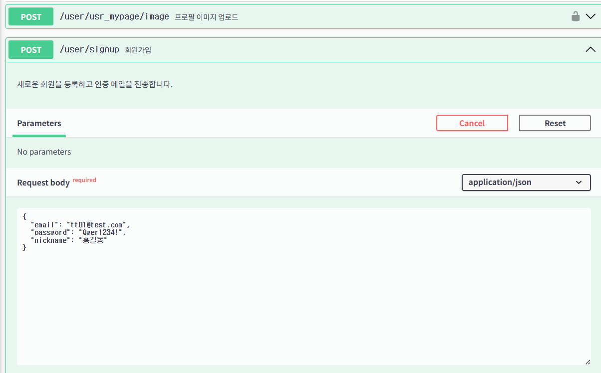
<h5>응답</h5>
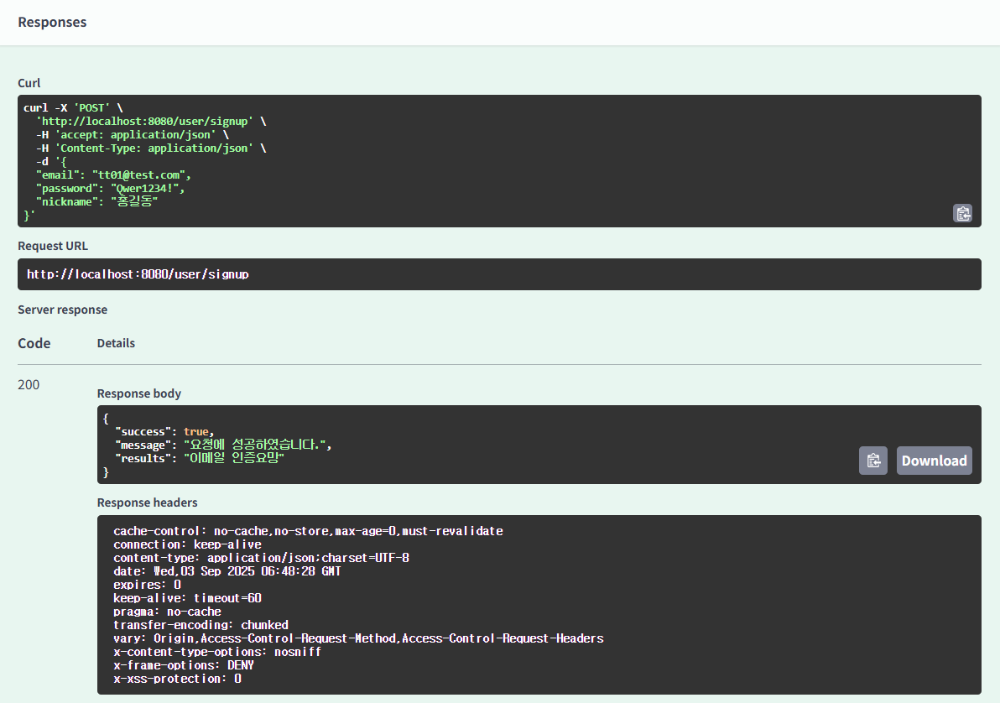

### -  이메일인증 API (`POST /user/verify`)

  
👉 클릭해서 테스트 결과 보기

<h5>요청</h5>
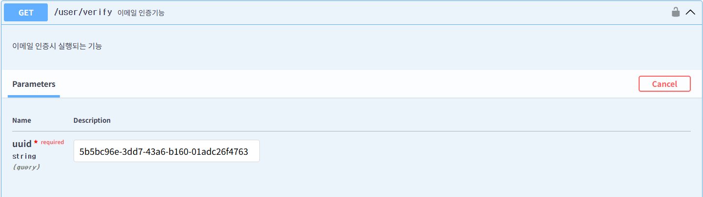
<h5>응답</h5>
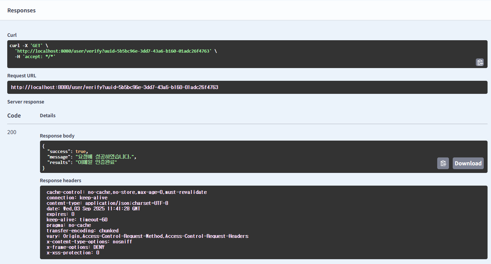
<h5>실제요청화면</h5>
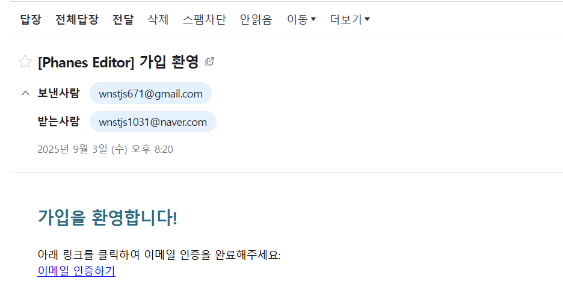

### -  로그인 API (`POST /user/login`)

  
👉 클릭해서 테스트 결과 보기

<h5>요청</h5>
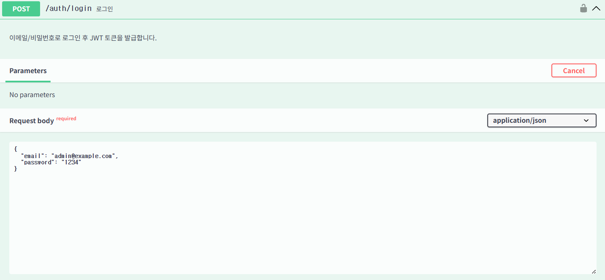
<h5>응답</h5>
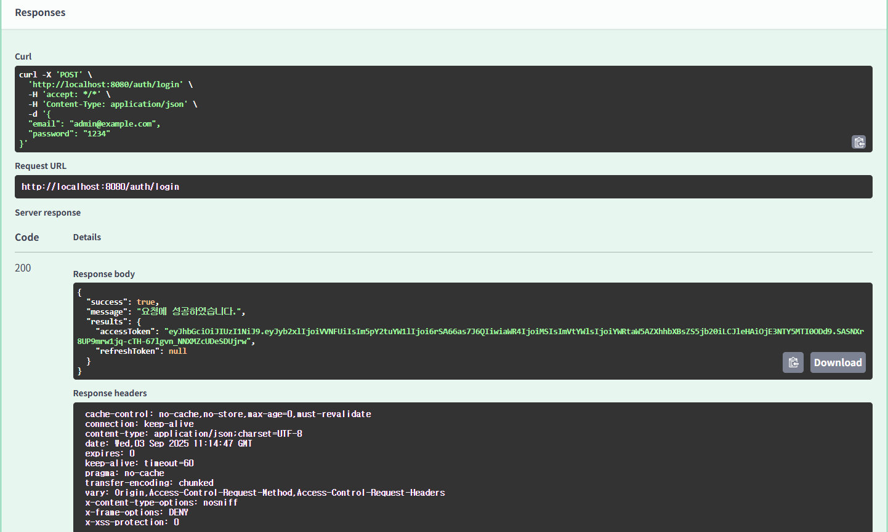

### - 프로필 조회 API (`POST /user/usr_mypage`)

  
👉 클릭해서 테스트 결과 보기

<h5>요청 (전달받은 토큰을 통해 로그인 한 유저의 정보 조회)</h5> 
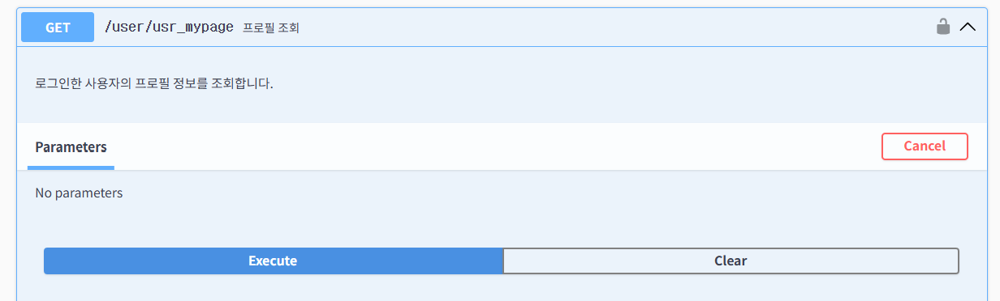
<h5>응답</h5>
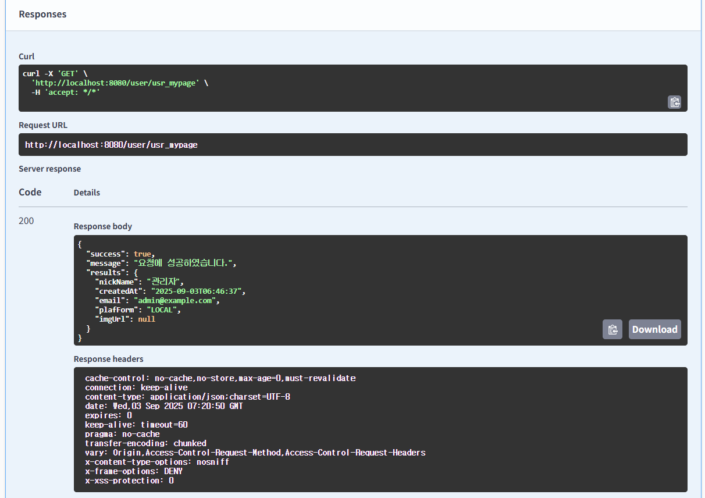

### - 프로젝트 생성 API (`POST /project/create`)

  
👉 클릭해서 테스트 결과 보기

<h5>요청</h5> 
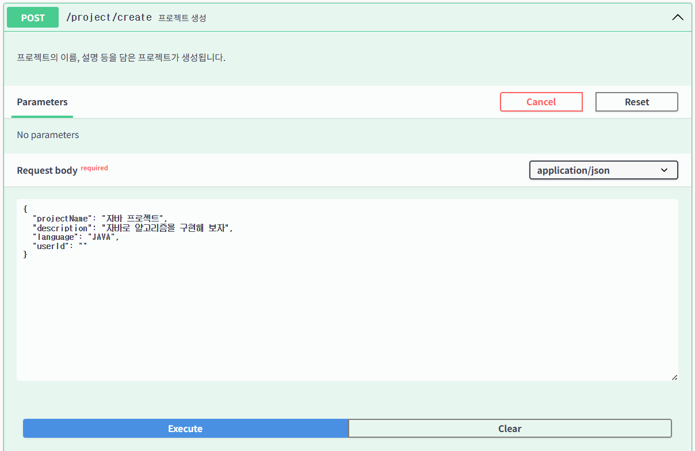
<h5>응답</h5>
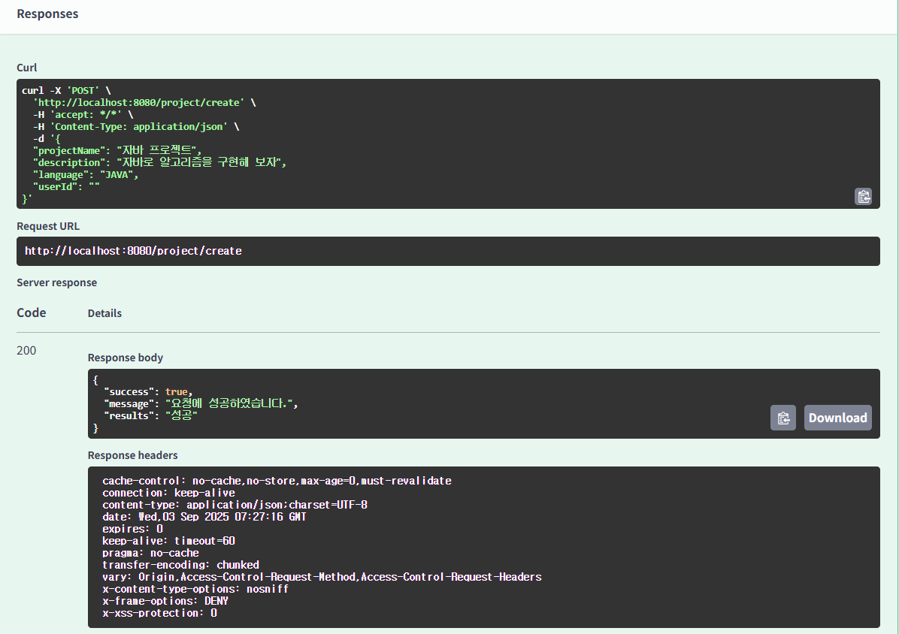

### - 프로젝트 검색 API (`POST /project/search`)

  
👉 클릭해서 테스트 결과 보기

<h5>요청</h5> 
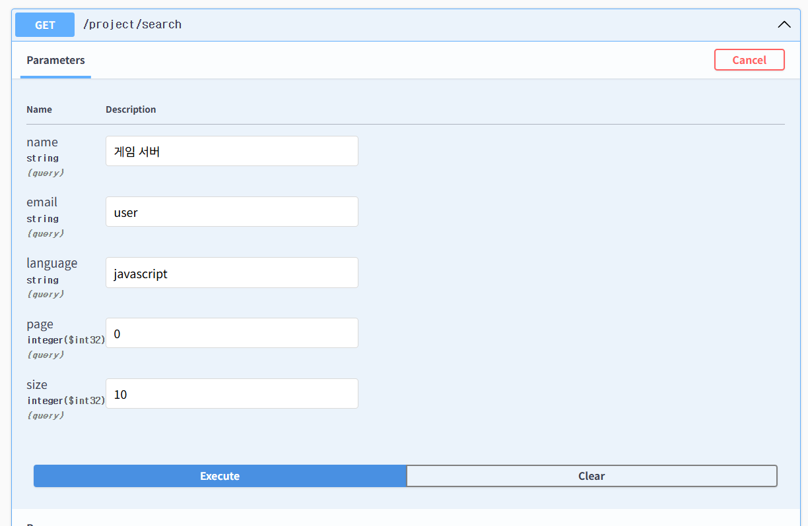
<h5>응답</h5>
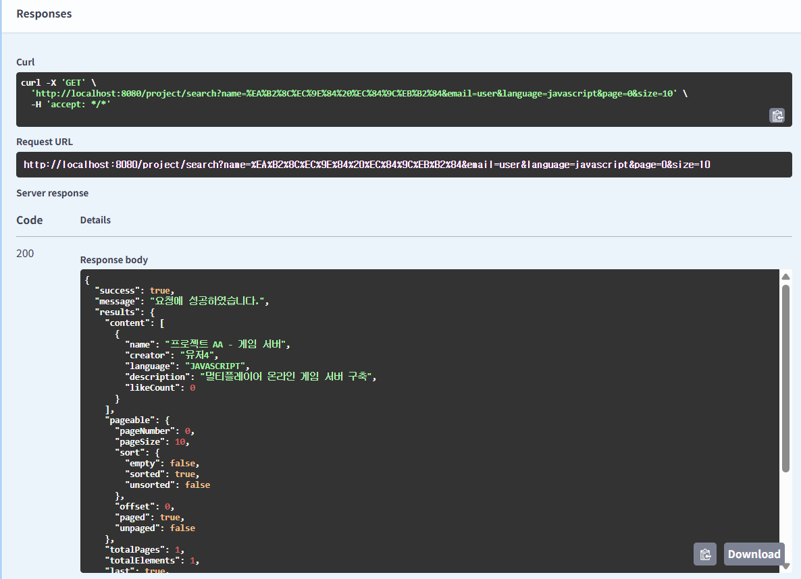

### - 파일저장 API (`POST /user/signup`)

  
👉 클릭해서 테스트 결과 보기

<h5>요청</h5>

<h5>응답</h5>

---

### ⚡ 성능 개선

<h4>1️⃣ 개선 전 (Users = 1000)</h4>
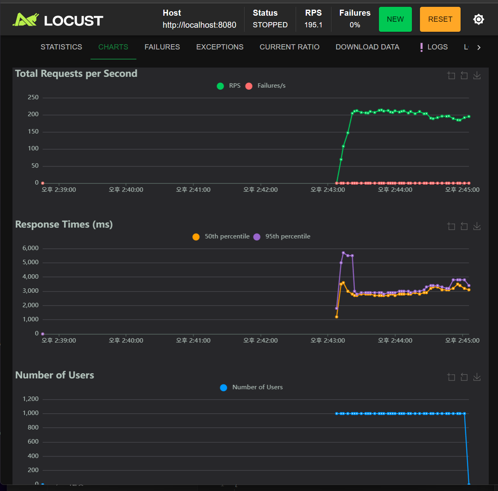

<table>
  <tr>
    <th>Type</th><th>Name</th><th># Requests</th><th># Fails</th><th>Median (ms)</th><th>95%ile (ms)</th><th>99%ile (ms)</th><th>Average (ms)</th><th>Min (ms)</th><th>Max (ms)</th><th>RPS</th>
  </tr>
  <tr>
    <td>GET</td><td>/project/read?idx=1</td><td>23207</td><td>0</td><td>2900</td><td>3700</td><td>5000</td><td>2963.19</td><td>813</td><td>5919</td><td>195.1</td>
  </tr>
</table>

<h4>2️⃣ 개선 후 (Users = 1000)</h4>
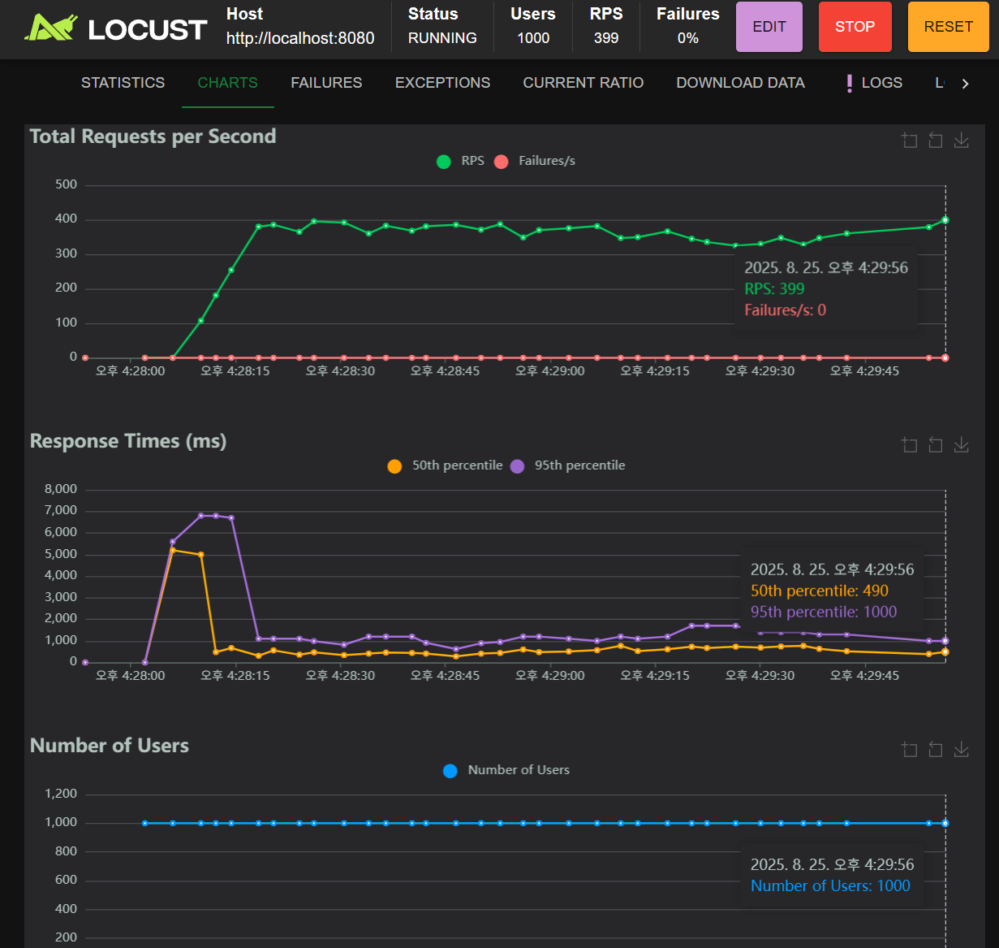

<table>
  <tr>
    <th>Type</th><th>Name</th><th># Requests</th><th># Fails</th><th>Median (ms)</th><th>95%ile (ms)</th><th>99%ile (ms)</th><th>Average (ms)</th><th>Min (ms)</th><th>Max (ms)</th><th>RPS</th>
  </tr>
  <tr>
    <td>GET</td><td>/project/read?idx=1</td><td>22709</td><td>0</td><td>470</td><td>1400</td><td>6700</td><td>754.75</td><td>10</td><td>7191</td><td>381.5</td>
  </tr>
</table>

➡️ 평균 응답 속도가 <b>2963ms → 754ms</b>로 약 4배 개선

<h4>3️⃣ 개선 후 (Users = 2000)</h4>
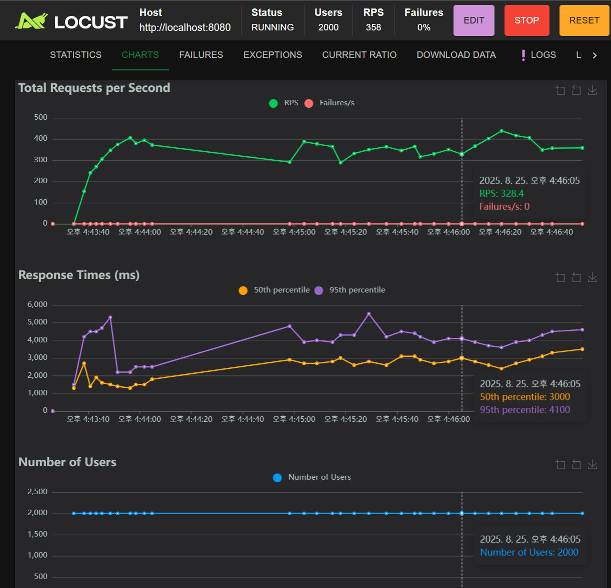

<table>
  <tr>
    <th>Type</th><th>Name</th><th># Requests</th><th># Fails</th><th>Median (ms)</th><th>95%ile (ms)</th><th>99%ile (ms)</th><th>Average (ms)</th><th>Min (ms)</th><th>Max (ms)</th><th>RPS</th>
  </tr>
  <tr>
    <td>GET</td><td>/project/read?idx=1</td><td>94396</td><td>0</td><td>2600</td><td>4200</td><td>6100</td><td>3032.26</td><td>53</td><td>175384</td><td>407.2</td>
  </tr>
</table>

➡️ 2000명 부하에서도 초기 1000명 성능보다 <b>더 높은 처리량(RPS)</b>을 유지

<h4>📊 적용한 개선 방법</h4>
<ul>
  <li><code>files</code> 엔티티는 <b>Fetch Join</b>으로 즉시 조회</li>
  <li><code>project_member</code> → <code>user</code> 조회는 <b>EAGER Fetch</b>로 변경</li>
  <li>기존 <code>@BatchSize</code> 로 인해 발생하던 <code>IN (1 ~ 100)</code> 반복 조회 제거</li>
</ul>

<h4>📊 선택한 이유</h4>
<ul>
  <li>
    <b>files → Fetch Join</b> 
    프로젝트 상세 조회 시 <code>files</code> 목록은 항상 필요하므로  
    한 번의 쿼리로 함께 가져오도록 최적화 → <b>N+1 문제 방지</b> 
    <i>⚠️ 단점:</i> Fetch Join을 남발하면 조인으로 인한 결과 뻥튀기 가능성이 있음 
    <i>✅ 하지만:</i> 우리 서비스에서는 파일 목록은 필수적으로 항상 필요하므로,  
    불필요한 데이터 조회 우려보다 <b>쿼리 단순화와 성능 개선</b> 이점이 더 큼
  </li>
  <li>
    <b>project_member → user → EAGER Fetch</b> 
    <code>project_member</code>는 유저 닉네임/정보를 반드시 조회해야 하므로  
    LAZY + BatchSize로 반복 IN 쿼리를 날리기보다,  
    <b>즉시 조인</b>으로 가져오는 것이 더 효율적 
    <i>⚠️ 단점:</i> EAGER Fetch는 항상 조인을 발생시켜 불필요한 데이터까지 로딩할 수 있음 
    <i>✅ 하지만:</i> 우리 서비스에서는 <code>project_member</code> 조회 시 <b>user 데이터가 100% 필요</b>하기 때문에,  
    불필요한 조인보다 <b>N+1 제거</b> 효과가 훨씬 크게 작용
  </li>
  <li>
    <b>@BatchSize 제거</b> 
    BatchSize는 <code>IN (1 ~ 100)</code> 반복 쿼리 문제를 완전히 해결하지 못했음  
    쿼리 호출 횟수가 여전히 많아 성능 저하 →  
    Fetch Join & EAGER 전략으로 대체해 <b>쿼리 수 최소화</b> 
    <i>⚠️ 단점:</i> BatchSize는 일부 상황에서 여전히 유용할 수 있는 최적화 기법 
    <i>✅ 하지만:</i> 우리 서비스의 경우 항상 대량 데이터가 필요하기 때문에  
    BatchSize보다 <b>즉시 로딩 전략</b>이 더 안정적이고 효율적임
  </li>
</ul>

<h4>✅ 결과</h4>
<ul>
  <li>평균 응답 속도: <b>2963ms → 754ms (약 4배 개선)</b></li>
  <li>동시 사용자 2000명 부하에서도 안정적인 응답 성능 유지</li>
  <li>쿼리 호출 횟수 감소 (최대 3번으로 제한)</li>
</ul>

<h4>📝 최종 쿼리</h4>

<pre><code class="language-sql">
select ... 
from project p1_0 
left join files fl1_0 on p1_0.idx=fl1_0.project_idx 
where p1_0.idx=?;

select ... 
from project_member pml1_0 
left join users u1_0 on u1_0.idx=pml1_0.user_id 
where pml1_0.project_id=?;

select ...
from chats cl1_0
where cl1_0.project_id=?;
</code></pre>

➡️ 최종적으로 <b>3개의 쿼리</b>만 실행되며, 성능이 크게 향상됨 🚀

---

### 📏 코딩 컨벤션
<h4>📌 Response 처리</h4>
<ul>
  <li><code>BaseResponse</code> 공통 응답 객체 사용</li>
  <li>성공 / 에러 응답은 <b>static 메서드 방식</b>으로 제공</li>
</ul>

<pre><code class="language-java">
return BaseResponse.success(data);
return BaseResponse.error("에러 메시지");
</code></pre>

<!-- Request / Response 원칙 -->
<h4>📌 Request / Response 원칙</h4>
<ul>
  <li><b>Request</b> : 클라이언트는 요청에 필요한 데이터만 최소한으로 전송</li>
  <li><b>Response</b> : DB에서 조회한 데이터를 가공하지 않고 그대로 반환</li>
  <li> → 불필요한 데이터가 포함될 수 있음 (단순화 우선)</li>
</ul>

<!-- DTO 규칙 -->
<h4>📌 DTO 규칙</h4>
<ul>
  <li><code>BoardReq</code>, <code>BoardList</code>, <code>BoardRead</code> 등 목적별 DTO 분리</li>
  <li>모든 DTO에 <b>Builder 패턴</b> 적용</li>
</ul>

<pre><code class="language-java">
@Builder
public class BoardReq {
    private String title;
    private String content;
}
</code></pre>

<!-- 로그인 처리 -->
<h4>📌 로그인 처리</h4>
<ul>
  <li><b>Spring Security Filter 기반 인증/인가</b> 사용</li>
  <li><code>LoginFilter</code>, <code>JwtAuthFilter</code> 등을 활용해 토큰 검증 및 인증 흐름 관리</li>
</ul>

### 🏗️ 시스템 아키텍처

### 🧩 소프트웨어 아키텍처

---
