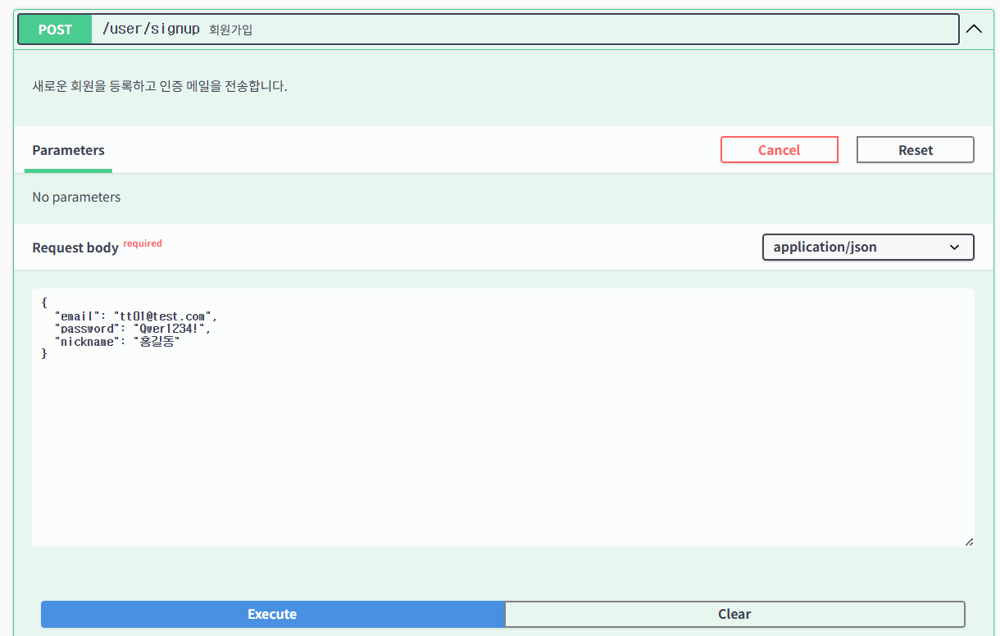

<h1>설치 없이 즐기는 실시간 코드 공유</h1>
<h3>팀워크 강화, Phanes Editor로 완성하세요</h3>

---

## 👨‍👩‍👧‍👦 팀원

<figure>
  <table>
    <tr>
      <td align="center">
         
        팀원: <a href="https://github.com/why48382">이현식</a>
      </td>
      <td align="center">
         
        팀원: <a href="https://github.com/junsun-yeam">염준선</a>
      </td>
    </tr>
  </table>
</figure>

---

<h3>🌐 프론트엔드 주소</h3> 
👉 <a href = "http://gomorebi.kro.kr">도메인 주소</a>

---

 
<h3 id="devtools">⚙️ 기술 스택</h3>

<!-- Database -->
<h4>📂 Database</h4>

  

<!-- Infrastructure -->
<h4>☁️ Infrastructure (예정) </h4>

  
  

<!-- Backend -->
<h4>🚀 Backend</h4>

  
  
  
  
  
  

<!-- Frontend -->
<h4>💻 Frontend</h4>

  
  
  
  

<!-- Tools -->
<h4>🛠️ Tools</h4>

  
  
  
  

<!-- Communication -->
<h4>💬 Communication</h4>

  

### 📖 API 명세서
👉 <a href = "http://localhost:8080/swagger-ui/index.html">API 명세서</a>

### 🚀 주요 기능
- 회원가입
- 이메일 인증 기능
- 로그인 기능
- 프로필 조회
- 프로젝트 생성
- 프로젝트 검색
- 실시간 코드 동시 편집 (Monaco Editor + STOMP)
- 프로젝트별 실시간 채팅
- 로그아웃

## ✅ 기능 테스트

각 주요 기능은 Swagger를 통해 직접 호출하여 검증하였습니다.  
테스트 결과는 요청/응답 화면 캡처 및 실제 동작으로 정리하였습니다.  

### - 회원가입 API (`POST /user/signup`)

  
👉 클릭해서 테스트 결과 보기

<h5>요청</h5>

<h5>응답</h5>

### -  이메일인증 API (`POST /user/verify`)

  
👉 클릭해서 테스트 결과 보기

<h5>요청</h5>

<h5>응답</h5>

<h5>실제요청화면</h5>

### -  로그인 API (`POST /user/login`)

  
👉 클릭해서 테스트 결과 보기

<h5>요청</h5>

<h5>응답</h5>

### - 프로필 조회 API (`POST /user/usr_mypage`)

  
👉 클릭해서 테스트 결과 보기

<h5>요청 (전달받은 토큰을 통해 로그인 한 유저의 정보 조회)</h5> 

<h5>응답</h5>

### - 프로젝트 생성 API (`POST /project/create`)

  
👉 클릭해서 테스트 결과 보기

<h5>요청</h5> 

<h5>응답</h5>

### - 프로젝트 검색 API (`POST /project/search`)

  
👉 클릭해서 테스트 결과 보기

<h5>요청</h5> 

<h5>응답</h5>

### - 파일저장 API (`POST /user/signup`)

  
👉 클릭해서 테스트 결과 보기

<h5>요청</h5>

<h5>응답</h5>

---

### ⚡ 성능 개선
- 프로젝트 `likesCount` 컬럼 반정규화 → 조회 성능 개선
- N+1 문제 해결 (fetch join, BatchSize)
- Redis 캐싱 도입 (세션/토큰, 최근 작업 캐시)

### 📏 코딩 컨벤션
- 네이밍 룰, 패키지 구조 규칙
- Controller → Service → Repository 3계층 구조
- DTO 분리 원칙

### 🏗️ 시스템 아키텍처

### 🧩 소프트웨어 아키텍처

---
